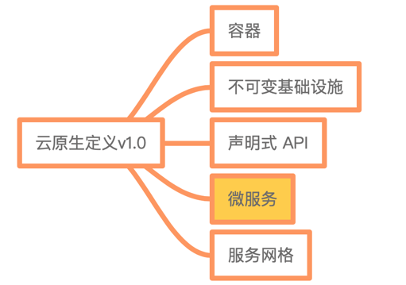
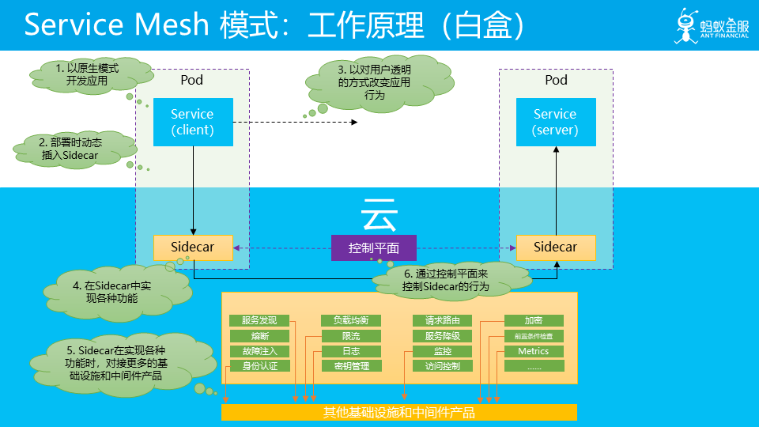
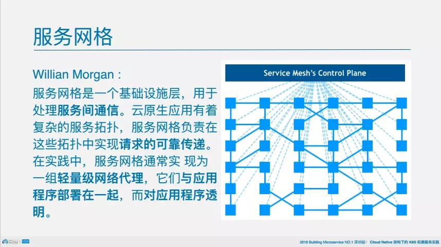
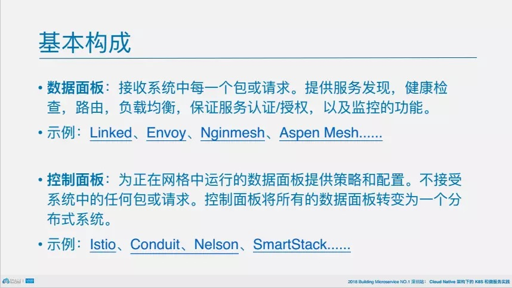
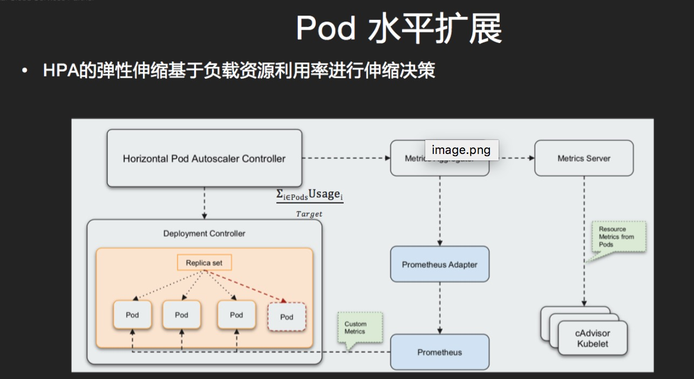
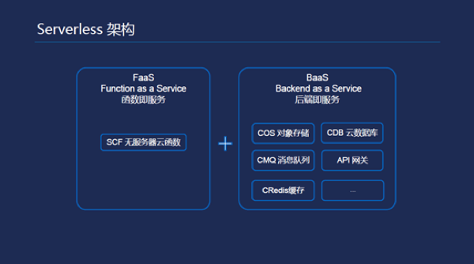
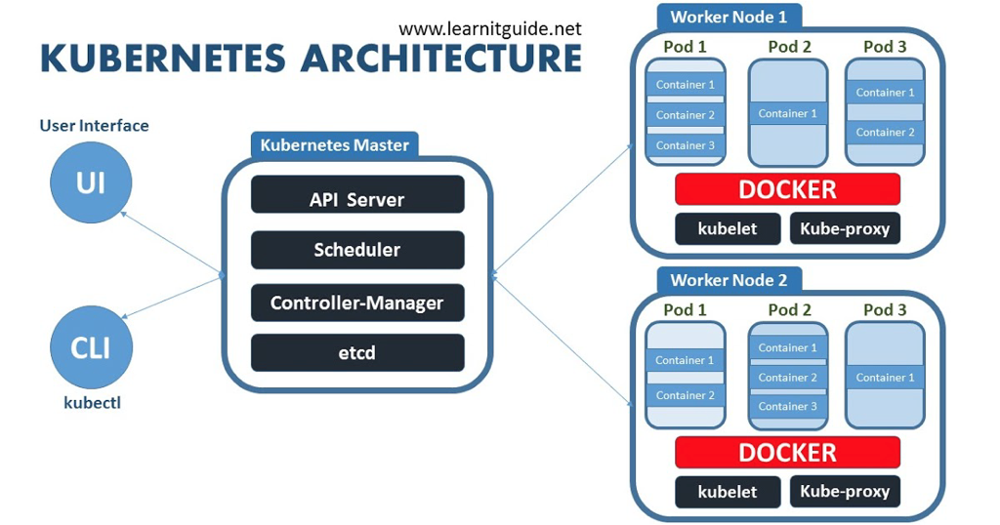
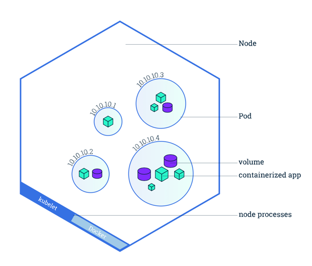
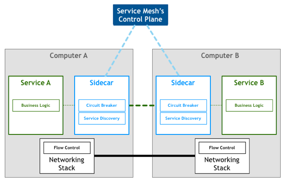
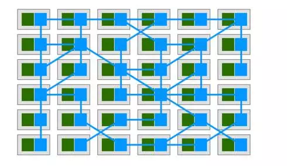

什么是 Native？ 与生俱来的。

应用被设计为云上最佳运行方式 ，充分发挥云的优势；

云提供：

    1）、 cpu shares / 硬盘 / 内存 / 
    2）、 RPC （负载，限流 ，熔断）
    3）、 NOTIFY （pull ，push）

云可以在提供各种资源之外，还提供各种能力，从而帮助应用，使得应用可以专注于业务需求的实现。
非业务需求相关的功能都被移到云，或者说基础设施中去了，以及下沉到基础设施的中间件。

云原生技术用于各组织在公有云、私有云和混合云等新型动态环境中，构建和运行可弹性扩展的应用。云原生的代表技术包括容器、服务网格、微服务、不可变基础设施和声明式API。

以一个简单应用为例：

需要实现上面列举的各种功能。
引入云之后：

体现在将 SDK 客户端的功能剥离出来，放到 Sidecar 中。就是把更多的事情下沉，下沉到基础设施中。

Service Mesh  服务网格

服务网格的基本构成

云计算是通过规模效应，平衡不同租户的业务波峰波谷，大大减少宏观规模的IT使用成本。在云时代，弹性已经成为新常态，也是CNCF调查中客户最为关注的云原生应用特性之一。

在云时代，弹性伸缩解决的不仅是激增的流量峰值与资源容量规划的矛盾，也是资源成本与系统可用性的博弈。

所有弹性的架构大多由有几个基本部分组成

1）、监控指标的采集

2）、监控指标聚合，判断是否触发伸缩条件

3）、执行伸缩动作

Kubernetes将支持弹性伸缩分成两个维度：

1）、资源维度：保障集群资源池大小满足整体容量规划，由于资源不足导致未调度的Pod事件作为资源维度伸缩的触发条件。

2）、应用维度：保障应用负载处在容量规划之内

对伸缩策略分为两类

1）、水平伸缩 (Scale out/in)
    
   Cluster Autoscaler (CA) -> 自动调整资源池（Worker节点）规模
    
   Horizontal Pod Autoscaler (HPA) -> 自动调整Pod的复本数量

2）、垂直伸缩 (Scale up/down)
 
   Vertical Pod Autoscaler (VPA) - 自动调整应用资源分配
   

Cluster Autoscaler 会监听所有的Pod，当Pod出现因资源不足导致未调度的时候，会将配置的Auto Scaling Group（ASG弹性伸缩组）模拟成为一个虚拟节点，尝试将未调度的容器进行重新调度，并选择一个符合条件ASG进行节点伸缩。没有扩容任务的时候，会便利每个节点的Request资源利用率，低于阈值的时候会逐个删除。

Metrics  Aggregator  指标汇总器

HPA Controller 通过 Metrics Aggregator 聚合 Metrics Server和Prometheus adapter采集的性能指标，并计算一个Deployment需要多少复本可以支持目标的工作负载。

为了防止扩缩容震荡，K8s提供缺省冷却周期设置：扩容冷却时间3分钟，缩容冷却时间5分钟

HPA对无状态服务非常有帮助，通过增加复本数量来应对业务增长。但是对于一些遗留的有状态应用，比如数据库，消息队列等，很多无法通过水平扩展来实现扩容，通常需要分配更多的计算资源来实现扩容。

Kubernetes中提供了request/limits这样资源调度和限制策略，然而如何根据业务水平，正确设置应用资源，是一个挑战。如果分配的资源用量过小，导致稳定性问题，比如OOM， CPU争抢，如果设置的资源过高，则会影响系统利用率。

Serverless定义

无服务器架构,Serverless不代表再也不需要服务器了，而是说：开发者再也不用过多考虑服务器的问题，计算资源作为服务而不是服务器的概念出现。Serverless是一种构建和管理基于微服务架构的完整流程，允许你在服务部署级别而不是服务器部署级别来管理你的应用部署，你甚至可以管理某个具体功能或端口的部署，这就能让开发者快速迭代，更快速地开发软件

通过Kubernetes你可以

快速部署应用

快速扩展应用

无缝对接新的应用功能

节省资源，优化硬件资源的使用​

Kubernetes同类产品

Docker Swarm、Apache Mesos以及阿里的Sigma

 
1）、etcd保存了整个集群的状态；

2）、apiserver提供了资源操作的唯一入口，并提供认证、授权、访问控制、API注册和发现等机制；

3）、controller manager负责维护集群的状态，比如故障检测、自动扩展、滚动更新等；

4）、scheduler负责资源的调度，按照预定的调度策略将Pod调度到相应的机器上；

5）、kubelet负责维护容器的生命周期，同时也负责Volume（CVI）和网络（CNI）的管理；

6）、Container runtime负责镜像管理以及Pod和容器的真正运行（CRI）；

7）、kube-proxy负责为Service提供cluster内部的服务发现和负载均衡；​

docker可以作为k8s的容器组件,应用部署时发现差异还是挺大的,在docker中应用直接部署在docker上,在k8s中在docker之上有虚拟出POD的概念,应用部署在POD中

Pods和Nodes：

Node是Kubernetes中的工作节点，最开始被称为minion。一个Node可以是VM或物理机。每个Node（节点）具有运行pod的一些必要服务，并由Master组件进行管理，Node节点上的服务包括Docker、kubelet和kube-proxy
​
Pod是Kubernetes创建或部署的最小/最简单的基本单位，一个Pod代表集群上正在运行的一个进程。一个Pod封装一个应用容器（也可以有多个容器），存储资源、一个独立的网络IP以及管理控制容器运行方式的策略选项。Pod代表部署的一个单位：Kubernetes中单个应用的实例，它可能由单个容器或多个容器共享组成的资源。

Service Mesh

Service Mesh是专用的基础设施层，轻量级高性能网络代理。提供安全的、快速的、可靠地服务间通讯，与实际应用部署一起，但对应用透明。可以理解为云原生下的服务治理,一般将应用中公共的功能抽象出来成为一个服务如负载均衡、限流、熔断等.部署方式上使用了类似边车(sidecar)的方式。

应用作为服务的发起方，只需要用最简单的方式将请求发送给本地的服务网格代理，然后网格代理会进行后续的操作，如服务发现，负载均衡，最后将请求转发给目标服务。当有大量服务相互调用时，它们之间的服务调用关系就会形成网格，如下图所示：

ServiceMesh—Istio架构

Istio提供一种简单的方式来建立已部署的服务的网络，具备负载均衡，服务到服务认证，监控等等功能，而不需要改动任何服务代码。简单的说，有了Istio，你的服务就不再需要任何微服务开发框架（典型如Spring Cloud，Dubbo），也不再需要自己动手实现各种复杂的服务治理的功能（很多是Spring Cloud和Dubbo也不能提供的，需要自己动手）。只要服务的客户端和服务器可以进行简单的直接网络访问，就可以通过将网络层委托给Istio，从而获得一系列的完备功能。
可以近似的理解为：Istio = 微服务框架 + 服务治理
​
Istio服务网格逻辑上分为数据面板和控制面板。数据面板由一组智能代理（Envoy）组成，代理部署为边车，调解和控制微服务之间所有的网络通信。控制面板负责管理和配置代理来路由流量，以及在运行时执行策略。
​

Minikube

