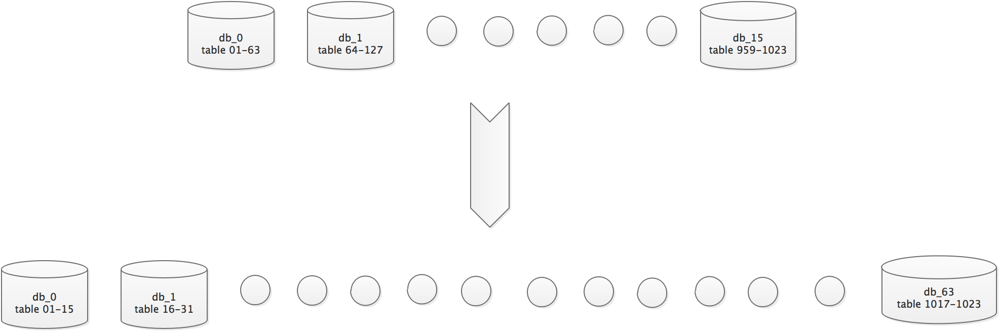

总共分表为1024张表，原有数据库数目为16个库（换言之每个库有64张表），扩容后总表数不变，数据库数目扩为64个库（每个库较少为16张表）。

目前的分片规则是根据user_id来做区分
如 user_id = 123456;
db_index = user_id % 1024 /16 =  32 号库
table_index = user_id % 1024  =  576 号表

next >> a-docs/from/li/拆库表实践.md

